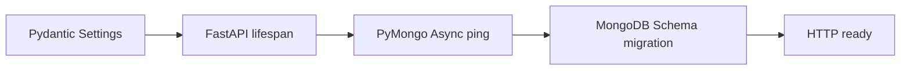
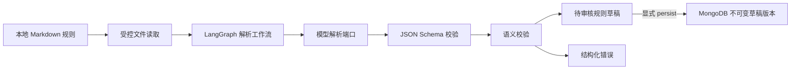

# RuleReader 技术设计文档

- 状态：`PHASE_1_6_IMPLEMENTED`
- 更新日期：2026-08-18
- 对应需求：[REQ-20260818-01](REQ-20260818-01-vibe-coding-bootstrap.md)
- 后端骨架需求：[REQ-20260818-02](REQ-20260818-02-backend-skeleton.md)
- 规则解析需求：[REQ-20260818-03](REQ-20260818-03-rule-parser.md)
- 草稿版本持久化需求：[REQ-20260818-04](REQ-20260818-04-rule-version-persistence.md)
- 范围决策：[BIZ-20260818-01](BIZ-20260818-01-phase1-local-documents.md)
- 技术栈决策：[BIZ-20260818-02](BIZ-20260818-02-python-langgraph.md)
- 运行时与模型决策：[BIZ-20260818-03](BIZ-20260818-03-python311-deepseek.md)
- JSON 与映射决策：[BIZ-20260818-05](BIZ-20260818-05-rule-json-version-mapping.md)
- Rule Parser DEV：[DEV-20260818-02](DEV-20260818-02-rule-parser.md)
- Rule Version DEV：[DEV-20260818-03](DEV-20260818-03-rule-version-persistence.md)
- 长期架构：[项目释放规则治理与诊断系统最终方案](../project_release_double_agent_solution.md)

## 1. 文档定位

根目录总体方案描述长期目标架构。本文件只规定当前第一阶段必须遵守的架构边界。运行时已确定为 Python `3.11.9`，依赖管理已确定为 `venv + pip + pyproject.toml`，Agent 编排框架已确定为 LangGraph，模型供应商已确定为 DeepSeek；具体 DeepSeek 模型和调用方式、规则模块布局、输入输出 Schema 及解析入口必须在编码前通过独立 `DEV` 文档确认。

## 2. 第一阶段逻辑链路

Phase 1.0 基础设施链路：

详细实现以 [DEV-20260818-01](DEV-20260818-01-backend-skeleton.md) 为准。MongoDB 只在基础设施层使用，不进入规则领域模型。

第一阶段链路到“待审核规则草稿”及其显式不可变归档为止，不包含审批、发布、执行和业务状态变更。

## 3. 组件职责

| 组件 | 职责 | 禁止事项 |
| --- | --- | --- |
| Local document adapter | 在配置根目录内读取 Markdown，规范化编码并生成来源元数据 | 不扫描未授权目录，不实现 Wiki 接口 |
| LangGraph workflow | 使用显式 state、node 和 edge 编排读取、模型解析、校验和结果组装 | 不包含领域校验实现，不发布或执行规则 |
| Rule parsing port | 定义从规则文本到结构化候选结果的稳定边界 | 不暴露具体模型 SDK 类型 |
| DeepSeek adapter | 调用 DEV 确认的 DeepSeek 模型并请求结构化输出，处理超时、限流和非法响应 | 不暴露供应商响应类型，不绕过校验返回有效草稿 |
| Schema validator | 校验 JSON 结构和字段约束 | 不调用模型修复结果 |
| Semantic validator | 校验条件树、操作符、类型、事实引用和案例一致性 | 不访问文件系统或外部服务 |
| Draft presenter | 返回草稿、来源和错误；具体采用 CLI 或 API 待 DEV 决定 | 不把草稿标记为已批准或已发布 |
| Rule version repository | 显式保存并按精确版本号回读不可变草稿 | 不更新、删除、审批或发布规则 |

## 4. 依赖方向

- 领域模型、Schema 相关类型和确定性语义校验处于内层，不依赖 LangGraph、模型 SDK、文件系统或数据库。
- 应用层使用 LangGraph 编排用例，但只通过抽象端口调用模型和文件适配器。
- 本地文件、DeepSeek 和入口位于外层适配器。
- FastAPI、Pydantic Settings 和 PyMongo 位于外层基础设施/交付层。
- 外层可以依赖内层，内层不得反向依赖外层。
- 当前阶段不引入面向 Wiki、RAG 或多数据源的抽象；MongoDB 提供连接、健康检查、版本化初始化和最小草稿版本仓储。

LangGraph 约束：

- state 使用显式的 Python 类型定义，只保存跨节点所需的可序列化业务数据。
- node 保持单一职责；文件读取、模型调用、Schema 校验和语义校验使用独立节点或清晰的可测试边界。
- 条件 edge 显式处理成功、可重试 Provider 失败、不可重试输入失败和校验失败。
- 第一阶段不启用持久化 checkpoint、人工中断恢复或分布式执行，除非后续 DEV 证明是当前验收所必需。

## 5. 核心契约原则

- 模型输出是不可信候选数据，只有 Schema 和语义校验均通过时才能形成待审核草稿。
- 草稿必须携带不可执行状态和来源元数据。
- 条件节点与操作符使用封闭集合，未知值直接失败。
- `requiredFacts` 必须可由条件树确定性推导或与其严格一致。
- 错误使用稳定错误码和字段路径表达；不得只返回模型原始文本。
- 内容哈希基于读取后用于解析的规范化内容计算，具体算法在 DEV 中确定。

## 6. 失败与安全边界

- 文件不存在、不可读、为空、路径越界或格式不支持时，在调用模型前失败。
- 模型超时、限流、空响应、非 JSON 和被截断响应分别归类，重试策略必须有上限。
- Schema 或语义校验失败时保留诊断信息，但不得产出“部分有效”规则。
- 默认日志不记录完整敏感规则正文和模型凭据。
- 默认测试使用测试替身，不依赖网络、真实模型或个人环境。
- MongoDB 不可达或 migration 失败时服务启动失败；就绪检查失败返回 503 且不泄露 URI/凭据。
- 显式保存失败时不得把未入库结果报告为已保存；唯一键冲突只能幂等回读，不能覆盖已有版本。

## 7. 已冻结实施依据

以下事项已分别由 [DEV-20260818-02](DEV-20260818-02-rule-parser.md) 和 [DEV-20260818-03](DEV-20260818-03-rule-version-persistence.md) 冻结并实现：

- Rule Parsing Agent 的模块布局和新增依赖；沿用已锁定的 Python `3.11.9`、`venv + pip`、Ruff、Mypy 与 Pytest 工具链。
- LangGraph state、node、edge、条件路由、终止状态和错误状态。
- DeepSeek 具体模型 ID、SDK 或 HTTP 调用方式、结构化输出能力、超时与重试策略。
- 本地规则模板、最终 JSON Schema、错误码和来源元数据字段。
- 首个交互入口采用 CLI、HTTP API 或测试驱动用例。
- 代表性样例、golden fixtures 和真实 Provider 测试启用方式。
