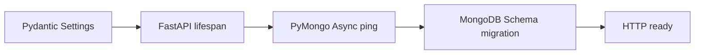
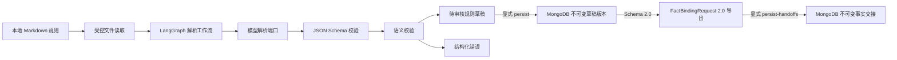

# RuleReader 技术设计文档

- 状态：`RULE_SCHEMA_V3_SLICE_1_2_IMPLEMENTED`
- 更新日期：2026-09-03
- 对应需求：[REQ-20260818-01](REQ-20260818-01-vibe-coding-bootstrap.md)
- 后端骨架需求：[REQ-20260818-02](REQ-20260818-02-backend-skeleton.md)
- 规则解析需求：[REQ-20260818-03](REQ-20260818-03-rule-parser.md)
- 草稿版本持久化需求：[REQ-20260818-04](REQ-20260818-04-rule-version-persistence.md)
- 规则契约 2.0 与事实交接需求：[REQ-20260819-01](REQ-20260819-01-rule-contract-v2-agent2-handoff.md)
- MongoDB 不可变事实交接需求：[REQ-20260824-01](REQ-20260824-01-mongodb-fact-binding-handoff.md)
- Schema 2.0 业务审核修订需求：[REQ-20260827-01](REQ-20260827-01-schema2-business-review-remediation.md)
- Rule Schema 3.0 需求：[REQ-20260902-01](REQ-20260902-01-rule-contract-v3-agent2-ready-handoff.md)
- 范围决策：[BIZ-20260818-01](BIZ-20260818-01-phase1-local-documents.md)
- 技术栈决策：[BIZ-20260818-02](BIZ-20260818-02-python-langgraph.md)
- 运行时与模型决策：[BIZ-20260818-03](BIZ-20260818-03-python311-deepseek.md)
- JSON 与映射决策：[BIZ-20260818-05](BIZ-20260818-05-rule-json-version-mapping.md)
- Rule Parser DEV：[DEV-20260818-02](DEV-20260818-02-rule-parser.md)
- Rule Version DEV：[DEV-20260818-03](DEV-20260818-03-rule-version-persistence.md)
- Rule Contract v2 DEV：[DEV-20260819-01](DEV-20260819-01-rule-contract-v2.md)
- Fact Binding Handoff DEV：[DEV-20260824-01](DEV-20260824-01-mongodb-fact-binding-handoff.md)
- Schema 2.0 业务审核修订 DEV：[DEV-20260827-01](DEV-20260827-01-schema2-business-review-remediation.md)
- 长期架构：[项目释放规则治理与诊断系统最终方案](../project_release_double_agent_solution.md)

## 1. 文档定位

根目录总体方案描述长期目标架构。本文件只规定当前第一阶段必须遵守的架构边界。运行时已确定为 Python `3.11.9`，依赖管理已确定为 `venv + pip + pyproject.toml`，Agent 编排框架已确定为 LangGraph，模型供应商已确定为 DeepSeek；具体 DeepSeek 模型和调用方式、规则模块布局、输入输出 Schema 及解析入口必须在编码前通过独立 `DEV` 文档确认。

## 2. 第一阶段逻辑链路

Phase 1.0 基础设施链路：

详细实现以 [DEV-20260818-01](DEV-20260818-01-backend-skeleton.md) 为准。MongoDB 只在基础设施层使用，不进入规则领域模型。

第一阶段链路到“待审核规则草稿”、显式不可变归档及 RuleReader 所有、SqlBot 只读的事实级交接为止，不包含 Agent 2 实现、审批、发布、执行和业务状态变更。

## 3. 组件职责

| 组件 | 职责 | 禁止事项 |
| --- | --- | --- |
| Local document adapter | 在配置根目录内读取 Markdown，规范化编码并生成来源元数据 | 不扫描未授权目录，不实现 Wiki 接口 |
| LangGraph workflow | 使用显式 state、node 和 edge 编排读取、模型解析、退避、逐次审计、校验和结果组装 | 不包含领域校验实现，不发布或执行规则 |
| Rule parsing port | 定义从规则文本到结构化候选结果的稳定边界 | 不暴露具体模型 SDK 类型 |
| DeepSeek adapter | 调用 DEV 确认的 DeepSeek 模型并请求结构化输出，处理超时、限流和非法响应，提取受控 completion ID/token usage | 不暴露供应商响应类型或原始响应，不绕过校验返回有效草稿 |
| Parse idempotency coordinator | 以幂等键摘要和解析身份合并进程内在途调用，并在有界 LRU 中重放成功结果 | 不保存原始键/来源正文，不承诺跨进程或跨重启幂等，不创建数据库集合 |
| Schema validator | 校验 JSON 结构和字段约束 | 不调用模型修复结果 |
| Semantic validator | 校验条件树、操作符、类型、事实引用和案例一致性 | 不访问文件系统或外部服务 |
| Draft presenter | 返回草稿、来源和错误；具体采用 CLI 或 API 待 DEV 决定 | 不把草稿标记为已批准或已发布 |
| Rule version repository | 显式保存并按精确版本号回读不可变草稿 | 不更新、删除、审批或发布规则 |
| Fact binding exporter | 从已校验 Schema 2.0 草稿确定性导出非派生 `FactBindingRequest 2.0.0`，补齐逻辑查询要求、来源证据和不确定性 | 不读取目标库元数据，不生成 SQL，不把未决信息提升为已确认映射，不降级输出旧契约 |
| Fact binding handoff service | 从精确回读的持久化 V2 规则生成请求，执行 Pydantic/静态 Schema/安全门禁、canonical hash、不可变写入和回读复核 | 不接受内存候选或旧 Schema，不调用 Provider，不修改规则版本，不补齐 blocking 项 |
| Fact binding handoff repository | insert-only 保存 `fact_binding_handoffs`，执行相同哈希幂等与不同哈希冲突检测 | 不提供 update、replace、delete，不允许 SqlBot 写入 |
| Reviewed remediation exporter | 对用户授权的 source-hash-bound profile 执行通用/专项审计并仅导出本地草稿和事实请求 | 不加载 Settings，不创建 Provider/数据库客户端，不提供持久化参数，不把离线通过解释为审批 |
| V3 rule structure contract | 表达多阶段、唯一优先级、首个命中、多 outcome、后置降级和显式 blocked 节点 | 不生成版本、案例、映射、SQL、发布或执行状态 |
| V3 confirmed fact catalog | 冻结确认事实语义、参数角色、空值/值域、证据和 binding profile 引用及 digest | 不嵌入完整 SQL，不把空白 XLSX 字段提升为确认事实 |
| V3 source selector | 从固定附件唯一提取项目报告与原始数据规则块并独立哈希 | 不把第 1.3 节外内容交给规则生成 |
| V3 multi-outcome evaluator | 确定性执行阶段顺序，允许 postGates/exclusions 将初步 READY 降级 | 不访问文件、模型、数据库或改变业务状态 |

## 4. 依赖方向

- 领域模型、Schema 相关类型和确定性语义校验处于内层，不依赖 LangGraph、模型 SDK、文件系统或数据库。
- 应用层使用 LangGraph 编排用例，但只通过抽象端口调用模型和文件适配器。
- 本地文件、DeepSeek 和入口位于外层适配器。
- FastAPI、Pydantic Settings 和 PyMongo 位于外层基础设施/交付层。
- 外层可以依赖内层，内层不得反向依赖外层。
- 当前阶段不引入面向 Wiki、RAG 或多数据源的抽象；MongoDB 提供连接、健康检查、版本化初始化、最小草稿版本仓储和 [REQ-20260824-01](REQ-20260824-01-mongodb-fact-binding-handoff.md) 授权的不可变事实交接仓储。

LangGraph 约束：

- state 使用显式的 Python 类型定义，只保存跨节点所需的可序列化业务数据。
- node 保持单一职责；文件读取、模型调用、Schema 校验和语义校验使用独立节点或清晰的可测试边界。
- 条件 edge 显式处理成功、可重试 Provider 失败、不可重试输入失败和校验失败。
- 可重试分支在下一次 Provider 调用前执行 DEV 冻结的有界指数退避；state 只保存 provider-neutral 审计字段，不保存 SDK response 或原始幂等键。
- 第一阶段不启用持久化 checkpoint、人工中断恢复或分布式执行，除非后续 DEV 证明是当前验收所必需。

## 5. 核心契约原则

- 模型输出是不可信候选数据，只有 Schema 和语义校验均通过时才能形成待审核草稿。
- 草稿必须携带不可执行状态和来源元数据。
- 条件节点与操作符使用封闭集合，未知值直接失败。
- `requiredFacts` 必须可由条件树确定性推导或与其严格一致。
- Schema `2.0.0` 的公式、派生事实和日期计算必须使用结构化表达式；测试案例必须由确定性解释器执行。
- 测试案例的 `given` 必须先通过事实 `dataType/nullable/allowedValues` 校验；历史已持久化对象可按精确快照回读，但不能借兼容读取绕过当前写入门禁。
- Schema `1.0.0` 只读兼容，不自动迁移，也不能导出事实绑定请求。
- 规则 `schemaVersion` 与事实交接 `contractVersion` 独立演进；`FactBindingRequest 2.0.0` 是唯一运行时交接版本，`1.0.0` 仅冻结为历史测试契约。
- 新事实交接使用 Draft 2020-12 JSON Schema。实体、字段、筛选、聚合、时间范围和结果契约全部必填；不确定值以受控状态和阻塞项表达，不能靠缺字段表达。
- 静态 Schema 由 Pydantic 权威模型确定性导出并由独立 validator 回归，防止生成物、样例、HTTP 输出和领域模型漂移。
- MongoDB 交接只接受从 `rule_versions` 精确回读的 `RuleParseResultV2`；payload 以排序键、无非语义空白的 UTF-8 canonical JSON 计算 SHA-256，相同哈希幂等、不同哈希拒绝覆盖。
- 错误使用稳定错误码和字段路径表达；不得只返回模型原始文本。
- Provider 生成的成功草稿和最终错误共享 `ParseAudit`：逐次 outcome 归属到产生该候选的调用，token 汇总包含后来被候选门禁拒绝的已计费尝试。
- 客户端幂等键只绑定 Provider 解析用例；原始键立即哈希，同键异解析身份在创建调用任务前失败，无键请求不做自动内容去重。
- 内容哈希基于读取后用于解析的规范化内容计算，具体算法在 DEV 中确定。
- V3 Slice 1/2 使用独立候选和事实目录契约；不加入 `RuleDocument` 运行时联合类型，也不改变当前
  Schema `2.0.0` 默认解析路径。
- V3 blocked 节点没有 `when`，必须引用顶层阻断；active 节点必须拥有可类型检查且只引用确认目录的
  条件 AST。解释器对任何候选级阻断返回 `INDETERMINATE`。
- V3 使用独立严格求值器，输入缺失不等于 null；类型/值域非法、派生值被外部覆盖、除零与日期溢出均
  安全失败。可达性必须通过独立的内存 witness 门禁证明，不能由 Schema 合法直接推定。
- 只读 XLSX 适配器保留确认原值与坐标，不执行工作簿中的代码/公式。实际类型/枚举冲突进入生成阻断，
  不通过空 allowedValues 或重写类型规避。最终实现证据见 [PROG-20260903](PROG-20260903.md)。

## 6. 失败与安全边界

- 文件不存在、不可读、为空、路径越界或格式不支持时，在调用模型前失败。
- 模型超时、限流、空响应、非 JSON 和被截断响应分别归类，重试策略必须有上限并执行可审计退避。
- Schema 或语义校验失败时保留诊断信息，但不得产出“部分有效”规则。
- 默认日志不记录完整敏感规则正文和模型凭据。
- 日志和错误不得记录原始幂等键、Prompt 或 Provider 原始响应；Provider request ID 和 token usage 必须先经过类型/长度门禁。
- 默认测试使用测试替身，不依赖网络、真实模型或个人环境。
- MongoDB 不可达或 migration 失败时服务启动失败；就绪检查失败返回 503 且不泄露 URI/凭据。
- 显式保存失败时不得把未入库结果报告为已保存；唯一键冲突只能幂等回读，不能覆盖已有版本。
- 事实交接写入前必须完成全批次双重契约与安全校验；交接集合冲突不得覆盖首次记录，写入后必须复核完整请求集合和来源规则未变化。

## 7. 已冻结实施依据

以下事项已分别由 [DEV-20260818-02](DEV-20260818-02-rule-parser.md)、[DEV-20260818-03](DEV-20260818-03-rule-version-persistence.md)、[DEV-20260819-01](DEV-20260819-01-rule-contract-v2.md)、[DEV-20260824-01](DEV-20260824-01-mongodb-fact-binding-handoff.md)、[DEV-20260827-01](DEV-20260827-01-schema2-business-review-remediation.md) 和 [DEV-20260827-02](DEV-20260827-02-deepseek-retry-audit-idempotency.md) 冻结并实现：

- Rule Parsing Agent 的模块布局和新增依赖；沿用已锁定的 Python `3.11.9`、`venv + pip`、Ruff、Mypy 与 Pytest 工具链。
- LangGraph state、node、edge、条件路由、终止状态和错误状态。
- DeepSeek 具体模型 ID、SDK 或 HTTP 调用方式、结构化输出能力、超时与重试策略。
- 本地规则模板、最终 JSON Schema、错误码和来源元数据字段。
- 首个交互入口采用 CLI、HTTP API 或测试驱动用例。
- 代表性样例、golden fixtures 和真实 Provider 测试启用方式。
- Schema `2.0.0` 表达式/条件 AST、事实闭包、类型校验、确定性案例执行、版本兼容和事实交接入口。
- `FactBindingRequest 2.0.0` 查询要求、来源证据、不确定性、静态 JSON Schema、样例、旧版协商和兼容性测试。
- MongoDB Schema v3、`fact_binding_handoffs` 所有权/索引、canonical hash、不可变幂等写入、冲突门禁和显式 CLI。
- source-hash-bound `reviewed-import-v2` 修订 profile、案例输入契约门禁、全条件双向覆盖审计和无持久化能力的本地导出路径。
- DeepSeek 有界指数退避、逐次 completion ID/token usage 审计、HTTP/CLI 幂等键和有界进程内并发合并/成功重放。
- REPORT_RELEASE / ruleStructure 的显式 V3 最小 LangGraph 分支及最多 3 次的共享请求预算；
  纠错对象和反馈仅存于单次运行内存，业务缺口、安全失败与预算耗尽均有独立停止路由，不接入 V2 默认入口。
