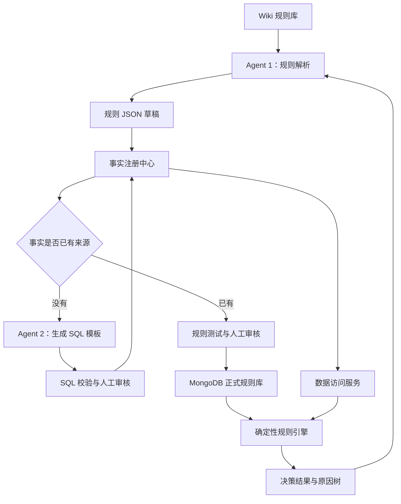
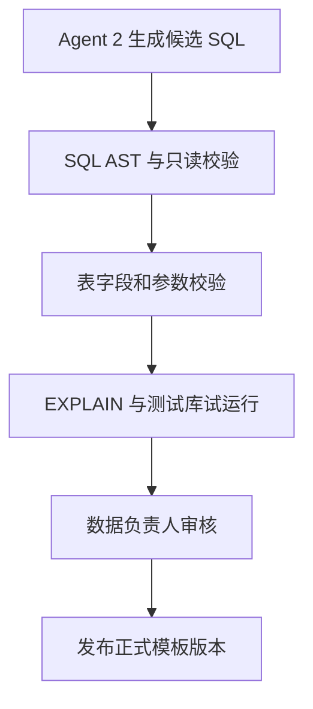
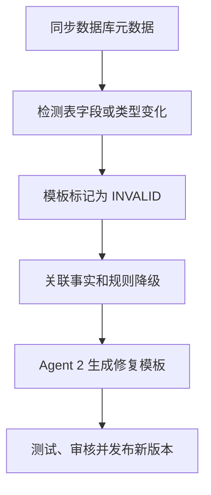

# 项目释放规则治理与诊断系统最终方案

> 文档定位：本文件描述长期目标架构，不等同于当前阶段实施清单。当前范围以 [`docs/进度文档.md`](docs/进度文档.md)、[`docs/实施文档.md`](docs/实施文档.md) 和已确认的 REQ/BIZ 为准。
>
> 2026-08-18 范围调整：当前第一阶段只实现使用本地 Markdown 的 Rule Parsing Agent，不接入 Wiki；详见 [`BIZ-20260818-01`](docs/BIZ-20260818-01-phase1-local-documents.md)。
>
> 技术栈调整：项目运行时使用 Python `3.11.9`，Agent 工作流使用 LangGraph，模型供应商使用 DeepSeek；详见 [`BIZ-20260818-02`](docs/BIZ-20260818-02-python-langgraph.md) 和 [`BIZ-20260818-03`](docs/BIZ-20260818-03-python311-deepseek.md)。

## 1. 文档目标

本方案用于解决以下问题：

- 项目报告和原始数据必须完成释放，才能进入下一步流程；
- 释放条件可能频繁变化，并且可能关联新的业务表、字段或外部系统；
- 规则变化不应频繁修改流程代码；
- 销售人员需要通过自然语言查询项目为什么没有释放；
- 系统需要确保规则判断、数据查询和诊断结果可追溯、可审核、可解释。

最终采用：

> Wiki 管理业务规则，Agent 1 解析规则，Agent 2 生成数据查询模板，人工审核后发布；后端负责数据查询和规则执行，Agent 1 最终向销售解释未释放原因。

两个 Agent 均不直接决定正式流程结果：

- Agent 1 负责规则解析和结果解释；
- Agent 2 负责数据来源发现和 SQL 模板生成；
- 后端规则引擎负责最终判断；
- 后端数据访问服务负责正式执行 SQL；
- 人工负责规则与 SQL 模板审核。

---

## 2. 总体架构



系统分为规则治理链路和正式运行链路：

1. **规则治理链路**：Wiki → Agent 1 → 规则 JSON → 事实绑定 → Agent 2 生成候选 SQL → 人工审核 → 发布。
2. **正式运行链路**：销售提问 → Agent 1 → 后端诊断接口 → 数据访问服务 → 规则引擎 → 原因树 → Agent 1 解释。

---

## 3. 模块职责

| 模块 | 主要职责 |
| --- | --- |
| Wiki | 编写业务规则、例外条件、失败原因和处理办法 |
| Agent 1 | 解析 Wiki、生成规则 JSON、提取所需事实、解释诊断结果 |
| Agent 2 | 分析数据库元数据、寻找数据来源、生成和修复候选 SQL 模板 |
| 事实注册中心 | 保存事实编码与 SQL、API、Python Provider 之间的映射 |
| SQL 模板中心 | 保存经过审核的参数化 SQL、输入参数、返回结构及版本 |
| 数据访问服务 | 加载正式模板、绑定参数、注入权限并执行查询 |
| 规则引擎 | 使用事实数据确定性地执行规则并生成判断轨迹 |
| MongoDB | 保存规则版本、审批记录、数据来源引用和决策快照 |
| 销售查询入口 | 接收项目查询并调用 Agent 1 解释结果 |

---

## 4. Agent 1：规则治理与结果解释

Agent 1 包含两个相互隔离的工作流，建议使用不同的 Prompt、工具权限和审计记录。

### 4.1 规则治理工作流

负责：

- 通过 Wiki API 按目录、标签、页面 ID 和修订版本同步规则；
- 解析适用范围、生效条件、例外条件、失败原因和处理建议；
- 转换为结构化 JSON 规则；
- 提取规则依赖的 `requiredFacts`；
- 生成正向、反向和边界测试案例；
- 展示 Wiki 原文和 JSON 规则之间的变更差异；
- 提交业务人员审核。

同步全部规则时不能只依赖向量检索。RAG 适合查询知识，但可能遗漏相似度较低的规则页面，因此规则同步必须通过 Wiki 的页面清单和修订记录完成。

### 4.2 Wiki 规则模板

```markdown
# 规则编号
PROJECT_RELEASE_001

# 适用范围
新能源并网项目

# 生效条件
报告审核通过，并且原始数据合格率达到 95%。
如果存在审批通过的豁免单，可以忽略合格率要求。

# 未通过原因
报告未审核通过或原始数据质量不达标。

# 处理建议
完成报告审核，修正原始数据，或申请豁免。

# 责任角色
项目负责人、数据负责人

# 测试案例
- 报告通过、数据合格率 96%：通过
- 报告通过、数据合格率 87%、无豁免：不通过
- 报告通过、数据合格率 87%、豁免通过：通过
```

### 4.3 规则 JSON 示例

```json
{
  "ruleCode": "PROJECT_RELEASE_001",
  "version": 1,
  "target": "PROJECT_RELEASE",
  "scope": {
    "projectType": ["GRID_CONNECTION"]
  },
  "condition": {
    "type": "ALL",
    "children": [
      {
        "type": "COMPARE",
        "factCode": "report.review.status",
        "operator": "EQ",
        "expected": "PASSED"
      },
      {
        "type": "ANY",
        "children": [
          {
            "type": "COMPARE",
            "factCode": "rawData.quality.passRate",
            "operator": "GE",
            "expected": 0.95
          },
          {
            "type": "COMPARE",
            "factCode": "release.exception.approved",
            "operator": "EQ",
            "expected": true
          }
        ]
      }
    ]
  },
  "requiredFacts": [
    "report.review.status",
    "rawData.quality.passRate",
    "release.exception.approved"
  ],
  "failure": {
    "reasonTemplate": "项目尚未满足释放条件",
    "nextAction": "完成报告审核、修正原始数据或申请豁免",
    "responsibleRoles": ["PROJECT_MANAGER", "DATA_ENGINEER"]
  },
  "source": {
    "pageId": "wiki-10082",
    "revision": 17,
    "contentHash": "sha256:..."
  }
}
```

### 4.4 销售解释工作流

销售提出“为什么项目 A 没有释放”后，Agent 1：

1. 根据项目名称或编号定位项目；
2. 调用后端释放诊断接口；
3. 获取资格状态、释放状态、失败条件、实际值、目标值和处理建议；
4. 必要时通过 Wiki RAG 查询制度说明和操作 SOP；
5. 使用销售能够理解的语言回答。

Agent 1 不重新计算规则，也不能根据 Wiki 猜测项目的实时状态。

---

## 5. Agent 2：数据来源发现与 SQL 模板生成

Agent 2 的定位是“数据映射工程师助手”，不是生产 SQL 执行器。

它负责：

- 读取数据库表、字段、注释、索引和关联关系；
- 根据未知 `factCode` 搜索可能的数据来源；
- 生成候选 SQL、查询口径说明和返回类型；
- 为候选 SQL 生成测试数据和预期结果；
- 发现表结构变化；
- 为失效 SQL 模板生成修复版本。

例如系统出现一个未注册事实：

```text
release.exception.approved
```

Agent 2 根据元数据发现候选表 `project_exception_approval`，生成：

```sql
SELECT
    CASE WHEN COUNT(*) > 0 THEN 1 ELSE 0 END AS fact_value
FROM project_exception_approval
WHERE project_id = :projectId
  AND approval_status = 'PASSED'
```

该 SQL 只能作为候选模板提交，必须通过安全校验、测试和人工审核后才能正式使用。

### 5.1 Agent 2 的介入时机

- 新规则出现未知事实；
- 原来的表、字段或字段类型发生变化；
- SQL 模板执行失败；
- 事实查询结果与测试案例不一致；
- 新增数据库或外部数据源；
- 需要重新分析表关联关系。

已有事实正常时，生产运行不调用 Agent 2。

---

## 6. 事实注册中心

事实是规则和底层数据之间的稳定契约。规则只引用 `factCode`，不引用表名和字段名。

```json
{
  "factCode": "rawData.quality.passRate",
  "factName": "原始数据合格率",
  "dataType": "DECIMAL",
  "providerType": "SQL_TEMPLATE",
  "providerRef": "RAW_DATA_PASS_RATE_V2",
  "status": "ACTIVE",
  "version": 2,
  "owner": "DATA_TEAM",
  "freshnessSeconds": 300
}
```

### 6.1 数据提供方式

| Provider 类型 | 适用情况 |
| --- | --- |
| `SQL_TEMPLATE` | 通过正式 SQL 模板获取数据 |
| `DOMAIN_API` | 调用其他业务系统接口 |
| `PYTHON_PROVIDER` | 进行复杂业务聚合或计算 |
| `DERIVED` | 根据其他事实计算 |
| `MANUAL_INPUT` | 系统没有数据，需要人工确认 |
| `CONSTANT` | 固定配置或枚举值 |

表结构发生变化时，只需要更新对应 SQL 模板或 Provider，不需要修改 Wiki 规则、规则 JSON 和规则引擎。

---

## 7. SQL 模板发布与执行

### 7.1 SQL 模板发布流程



正式模板示例：

```json
{
  "templateCode": "RAW_DATA_PASS_RATE",
  "version": 2,
  "factCode": "rawData.quality.passRate",
  "sql": "SELECT ... WHERE project_id = :projectId",
  "parameters": [
    {
      "name": "projectId",
      "type": "LONG",
      "required": true
    }
  ],
  "resultType": "DECIMAL",
  "allowedTables": ["raw_data_check"],
  "status": "ACTIVE",
  "approvedBy": "data-admin"
}
```

### 7.2 正式运行方式

运行时不向后端传原始 SQL，也不需要传模板内容，只传业务对象和事实编码：

```json
{
  "projectId": 10001,
  "factCodes": [
    "report.review.status",
    "rawData.quality.passRate",
    "release.exception.approved"
  ]
}
```

后端执行：

```text
factCode
→ 查找正式模板或 Provider
→ 注入项目、租户和用户权限
→ 参数化执行
→ 返回标准事实
```

禁止提供以下通用接口：

```python
def execute_sql(sql: str) -> object: ...
```

推荐提供：

```python
def query_facts(
    project_id: int,
    fact_codes: set[str],
    user_context: UserContext,
) -> FactBag: ...
```

正式 SQL 必须使用参数绑定，禁止通过字符串替换或拼接业务参数。

### 7.3 SQL 安全要求

- 数据库账号只具备只读权限；
- 优先查询只读副本或专用查询库；
- 只允许 `SELECT` 和必要的 `WITH`；
- 禁止 DDL、DML、存储过程和多语句；
- 使用 SQL AST 检查，不只依赖字符串匹配；
- 使用表、字段和函数白名单；
- 强制绑定项目、租户和用户权限；
- 限制最大返回行数、执行时间和 JOIN 数量；
- 发布前执行 `EXPLAIN` 和测试案例；
- 记录模板版本、调用人、业务参数、耗时和结果摘要。

---

## 8. 规则引擎设计

后续进入规则执行核心闭环时采用轻量级 JSON 规则树，不需要直接引入重型规则引擎。当前 Rule Parsing Agent 阶段只生成并校验规则草稿，不执行规则。

### 8.1 条件节点

| 节点 | 作用 |
| --- | --- |
| `ALL` | 所有子条件满足 |
| `ANY` | 任意子条件满足 |
| `NOT` | 条件取反 |
| `COMPARE` | 比较事实值和目标值 |
| `EXISTS` | 判断事实或业务数据是否存在 |

支持的基础操作符：

```text
EQ、NE、GT、GE、LT、LE
IN、NOT_IN
CONTAINS
IS_NULL、NOT_NULL
```

Python 结构示例：

```python
from typing import Union

ConditionNode = Union[
    AllNode,
    AnyNode,
    NotNode,
    CompareNode,
    ExistsNode,
]
```

### 8.2 核心组件

```text
RuleRepository
    从 MongoDB 加载指定场景的已发布规则

FactCollector
    遍历条件树并收集 requiredFacts

FactResolver
    根据事实注册中心获取所有事实

ConditionEvaluator
    递归执行 ALL、ANY、NOT、COMPARE、EXISTS

DecisionTraceBuilder
    记录每个条件的实际值、期望值和判断结果

DecisionRepository
    保存决策、规则版本、事实快照和原因树
```

### 8.3 执行流程

```python
def evaluate(rule_code: str, project_id: int) -> DecisionResult:
    rule = rule_repository.load_published(rule_code)
    fact_codes = fact_collector.collect(rule)
    facts = fact_resolver.resolve(project_id, fact_codes)
    trace = condition_evaluator.evaluate(rule.condition, facts)
    result = decision_factory.create(rule, facts, trace)
    decision_repository.save(result)
    return result
```

复杂统计、跨表聚合和远程接口调用不放入规则引擎，而是在事实层完成。例如事实层返回合格率 `0.87`，规则引擎只判断 `0.87 >= 0.95`。

---

## 9. 数据不完整与三值逻辑

规则引擎不能把“查询不到”直接解释为“不满足”，必须支持三值状态：

```text
PASS             满足
FAIL             不满足
INDETERMINATE    无法判定
```

| 情况 | 处理结果 |
| --- | --- |
| 数据正常且满足 | `PASS` |
| 数据正常但不满足 | `FAIL` |
| 数据来源未配置 | 阻止规则发布 |
| 数据源超时 | `INDETERMINATE` |
| SQL 模板失效 | `INDETERMINATE` |
| 业务上没有采集该数据 | 新增采集、人工确认或修改规则 |
| 可选事实不存在 | 只有规则明确配置默认值才能继续 |

逻辑计算方式：

- `ALL`：任一条件为 `FAIL`，最终为 `FAIL`；没有 `FAIL` 但存在 `INDETERMINATE`，最终为 `INDETERMINATE`；
- `ANY`：任一条件为 `PASS`，最终为 `PASS`；没有 `PASS` 但存在 `INDETERMINATE`，最终为 `INDETERMINATE`；
- `NOT`：`PASS` 和 `FAIL` 互换，`INDETERMINATE` 保持不变。

`INDETERMINATE` 默认禁止自动释放。如果允许人工强制处理，必须校验权限并保存原因、操作人和时间。

---

## 10. 释放状态设计

必须区分“是否满足释放条件”和“是否已经完成释放”。

### 10.1 资格状态

```text
PASS
FAIL
INDETERMINATE
```

### 10.2 执行状态

```text
NOT_RELEASED
RELEASING
RELEASED
RELEASE_FAILED
REVOKED
```

销售查询时需要区分：

- 条件未满足；
- 条件已经满足，但负责人尚未执行释放；
- 释放任务正在执行；
- 释放任务执行失败；
- 数据异常，暂时无法判断。

项目进入下一步流程时，应重新校验或使用仍然有效的最新决策，并确认项目报告和原始数据的实际释放状态均为 `RELEASED`。

---

## 11. 决策结果与原因树

规则引擎需要保存完整判断过程：

```json
{
  "decisionId": "D202608180001",
  "projectId": 10001,
  "eligibilityStatus": "FAIL",
  "releaseStatus": "NOT_RELEASED",
  "ruleCode": "PROJECT_RELEASE_001",
  "ruleVersion": 3,
  "factsAsOf": "2026-08-18T10:30:00+08:00",
  "failures": [
    {
      "factCode": "rawData.quality.passRate",
      "expected": 0.95,
      "actual": 0.87,
      "status": "FAIL",
      "reason": "原始数据合格率不足",
      "nextAction": "修正未通过校验的数据",
      "responsibleRole": "DATA_ENGINEER"
    }
  ]
}
```

Agent 1 可以据此回答：

> 项目当前未满足释放条件。项目报告已经审核通过，但原始数据合格率为 87%，低于规则要求的 95%。请数据负责人修正未通过校验的数据后重新提交。本次判断使用 V3 规则，数据更新时间为 2026-08-18 10:30。

---

## 12. 规则与模板生命周期

### 12.1 规则生命周期

```text
DRAFT
→ PARSED
→ DATA_BINDING
→ VALIDATED
→ TESTED
→ APPROVED
→ PUBLISHED
→ RETIRED
```

规则发布条件：

- JSON Schema 合法；
- 所有 `factCode` 已注册；
- 所有 SQL 模板或 Provider 已审核；
- 数据类型与操作符匹配；
- 正向、反向和边界测试通过；
- 历史项目回放和影响分析通过；
- 业务审核人批准；
- 涉及新数据来源时，数据审核人批准。

正式版本不可原地修改，只能创建新版本，并保留旧版本用于追溯和回滚。

### 12.2 SQL 模板生命周期

```text
CANDIDATE
→ VALIDATED
→ TESTED
→ APPROVED
→ ACTIVE
→ INVALID
→ RETIRED
```

---

## 13. 表结构变化处理流程



示例：

```text
RAW_DATA_PASS_RATE V1：RETIRED
RAW_DATA_PASS_RATE V2：ACTIVE
```

模板失效期间，相关事实返回 `UNAVAILABLE`，规则结果返回 `INDETERMINATE`，不能将技术故障解释为业务条件不满足。

---

## 14. 人工审核与自动测试

### 14.1 业务审核

- Wiki 原文与 JSON 是否一致；
- 适用范围是否正确；
- 条件组合和例外是否正确；
- 未通过原因和处理建议是否准确；
- 责任角色是否明确。

### 14.2 数据审核

- 表、字段和 JOIN 关系是否正确；
- 数据口径是否符合业务定义；
- 是否正确限制项目和租户范围；
- 参数和返回类型是否正确；
- 查询性能是否可接受；
- 无数据、异常数据和边界数据是否符合预期。

### 14.3 规则影响分析

发布前建议使用历史项目进行回放：

```text
受影响历史项目：126 个
结果不变：119 个
由可释放变为不可释放：5 个
由不可释放变为可释放：2 个
无法判定：0 个
```

---

## 15. Agent 与服务之间的通信

Agent 之间不直接传递正式规则文本和执行状态。正式规则发布后：

```text
MongoDB 保存不可变规则版本
→ 发布 RulePublished 事件
→ 下游根据 ruleCode、version、checksum 加载
```

事件示例：

```json
{
  "eventType": "RulePublished",
  "ruleCode": "PROJECT_RELEASE_001",
  "version": 3,
  "checksum": "sha256:...",
  "publishedAt": "2026-08-18T10:00:00+08:00"
}
```

这样可以避免 Agent 消息丢失、重复以及不同模块使用不同规则版本。

---

## 16. 核心接口建议

### 16.1 规则管理

```http
POST /api/rules/parse
POST /api/rules/{ruleId}/validate
POST /api/rules/{ruleId}/test
POST /api/rules/{ruleId}/approve
POST /api/rules/{ruleId}/publish
```

### 16.2 事实与 SQL 模板

```http
POST /api/facts/binding/suggest
POST /api/sql-templates/validate
POST /api/sql-templates/test
POST /api/sql-templates/{id}/approve
POST /api/sql-templates/{id}/publish
```

### 16.3 正式运行与诊断

```http
POST /api/facts/query
POST /api/release/evaluate
POST /api/release/diagnose
GET  /api/release/decisions/{decisionId}
```

---

## 17. 推荐技术实现

| 能力 | 建议实现 |
| --- | --- |
| 应用运行时 | Python `3.11.9` |
| Agent 编排 | LangGraph；仅用于应用工作流编排 |
| 模型供应商 | DeepSeek；具体模型和调用方式待 Phase 1 DEV 决定 |
| 服务入口 | CLI 或 Python Web/API 框架，待对应 DEV 决定 |
| Wiki 问答 | RAG，仅用于制度和 SOP 解释 |
| 正式规则存储 | MongoDB，不可变版本文档 |
| 规则校验 | JSON Schema + 自定义语义校验 |
| 规则执行 | Python 实现的确定性 JSON 条件树执行器 |
| SQL 执行 | Python 数据库驱动或 SQL 工具的参数绑定方式，具体库待后续 DEV 决定 |
| SQL 安全 | AST 解析、白名单、只读账号、超时和行数限制 |
| 事件通知 | Outbox + MQ；核心闭环初期可采用同步调用 |
| 缓存 | 可选 Redis，用于缓存已发布规则和当前决策 |

SQLBot 可以作为 Text-to-SQL、数据表管理、表关联、术语库、标准 SQL 示例及数据权限设计的参考，但正式释放判断必须走受控的模板执行和确定性规则引擎。

参考：

- [SQLBot GitHub](https://github.com/dataease/SQLBot)
- [SQLBot 最佳实践](https://sqlbot.org/docs/v1/best_practice/)
- [SQLBot 权限配置](https://sqlbot.org/docs/v1/user_manual/permission/)
- [Python 与 LangGraph 技术栈决策](docs/BIZ-20260818-02-python-langgraph.md)
- [Python 3.11.9 与 DeepSeek 决策](docs/BIZ-20260818-03-python311-deepseek.md)

---

## 18. 分阶段实施计划

### 第一阶段：本地文档规则解析（当前范围已冻结）

- 搭建 Python `3.11.9` + FastAPI 后端骨架，实现集中配置和 MongoDB 基础设施 Schema 初始化；
- 建立本地 Markdown 规则模板和代表性样例；
- 使用 Python `3.11.9`、LangGraph 和 DeepSeek 实现 Rule Parsing Agent，将规则文档转换为待审核 JSON 草稿；
- 提取 `requiredFacts`，生成或保留正向、反向和边界测试案例；
- 实现 JSON Schema 与确定性语义校验；
- 记录源文件路径、内容哈希和解析版本；
- 对文件错误、模型失败、非法输出和歧义规则返回明确错误；
- 通过离线自动化测试和显式启用的真实 Provider 测试验证闭环。

第一阶段明确不接入 Wiki，也不实现 Agent 2、SQL、事实注册、规则执行、正式发布、销售查询和生产集成。详细 DoD 以 [`docs/实施文档.md`](docs/实施文档.md) 为准。

### 第二阶段：核心运行闭环（待后续 REQ 冻结）

- 评估并接入 Wiki 规则来源与版本同步；
- 实现 MongoDB 规则版本管理；
- 建立事实注册中心；
- 人工编写并审核首批 SQL 模板；
- 实现 JSON 规则引擎；
- 保存决策原因树；
- 实现销售查询 Agent。

### 第三阶段：Agent 2（待后续 REQ 冻结）

- 同步数据库元数据；
- 建立表字段语义说明；
- 维护明确的 JOIN 关系；
- 实现 Agent 2 候选 SQL 生成；
- 实现 SQL 安全校验；
- 实现模板审核和版本管理。

### 第四阶段：生产增强（待后续 REQ 冻结）

- 历史项目规则回放；
- 规则变更影响分析；
- 表结构变化自动检测；
- 规则自动重新计算；
- 行列权限与数据脱敏；
- 运行监控、告警和完整审计；
- Wiki 制度与 SOP 的 RAG 问答。

---

## 19. 最终原则

1. Agent 1 理解业务规则并解释结果，但不直接决定流程状态。
2. Agent 2 帮助发现数据来源并生成 SQL 草稿，但不直接执行生产 SQL。
3. 运行时只传 `factCode` 和业务参数，由后端加载已审核模板并参数化执行。
4. 事实注册中心管理稳定的数据契约，使规则与底层表结构解耦。
5. 规则引擎使用确定性逻辑和三值状态生成最终结果。
6. 数据查询失败必须返回“无法判定”，不能伪装成业务不满足。
7. 规则、事实、SQL 模板和决策结果全部版本化、可审核、可回滚。
8. 销售 Agent 只根据正式决策轨迹进行解释，不猜测实时业务数据。

最终完整链路为：

> Wiki 定义业务规则 → Agent 1 提取规则和所需事实 → Agent 2 为未知事实生成候选 SQL → 人工审核并发布规则与模板 → 后端获取事实并执行确定性规则 → 保存决策原因树 → Agent 1 向销售解释未释放原因。
